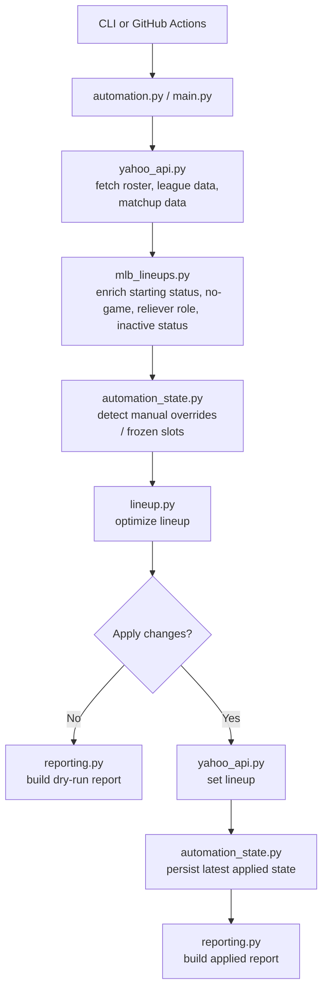

# Yahoo Fantasy Baseball Lineup Agent

An automated Yahoo Fantasy Baseball lineup operator that reads your roster, enriches it with live MLB context, decides what should change, applies moves back to Yahoo, and emails you a report.

This repo started as a dry-run lineup optimizer. It is now a multi-league, stateful automation system with:

- Yahoo OAuth and roster management
- MLB schedule and starting-lineup enrichment
- per-player status handling for `starting`, `not starting`, `lineup pending`, `no game`, relievers, and injured/inactive players
- league-specific profiles for different roster shapes and scoring systems
- scheduled GitHub Actions automation
- HTML email reports
- manual-override protection so the bot does not immediately undo your own changes
- scenario fixtures to regression-test lineup behavior

## What It Does

For a target date, the agent:

1. fetches your Yahoo roster
2. maps Yahoo players to MLB players
3. checks MLB schedule / probable starters / confirmed batting lineups
4. marks each player with a live status such as:
   - `starting`
   - `lineup pending`
   - `not starting`
   - `no game`
   - `reliever`
   - `inactive status`
5. runs lineup optimization with roster-slot and lock constraints
6. optionally applies the resulting moves to Yahoo
7. sends an email report with the proposed or applied lineup

## Current Capabilities

### Live lineup enrichment

The optimizer does not rely on Yahoo alone for lineup state. It uses MLB data to determine:

- whether a team has a game that day
- whether a hitter is in the confirmed starting lineup
- whether a pitcher is the probable starter
- whether a `P`-only pitcher should really be treated as a reliever

### Injury / inactive handling

Injured and inactive players are handled separately from starting-lineup logic.

- players in `IL` / `NA` slots are treated as unavailable
- players with Yahoo statuses like `IL10`, `IL15`, `IL60`, or `NA` are also treated as unavailable even if they are stranded on the bench

That prevents cases where a star player with a strong Yahoo profile but an active injury designation gets incorrectly reinserted.

### Multi-league support

The repo now supports multiple league profiles.

Current built-in profiles:

- `h2h_categories`
  - roster shape similar to standard Yahoo H2H baseball with `C/1B/2B/3B/SS/IF/LF/CF/RF/OF/Util/SP/RP/P`
  - supports matchup-aware experimentation
- `roto_5x5_dynasty`
  - supports deeper roto roster structures like `C/C/CI/MI/OFx5/Utilx2/Px8`
  - uses roto-oriented category definitions instead of matchup scoring

The active profile is chosen by:

- `YAHOO_LEAGUE_PROFILE`, or
- the Yahoo league ID inferred from `YAHOO_TEAM_KEY`

### Manual override protection

When the automation applies a lineup, it stores the last agent-applied state.

If you manually change a slot afterward, later runs can detect that divergence and freeze the affected slot for the rest of the day. That keeps the automation from fighting your manual decisions.

### Scheduled automation

The GitHub Actions workflow:

- polls hourly at `:30`
- computes the real trigger windows for that day from MLB start times
- runs only when a trigger window matches
- runs both configured leagues
- sends email reports
- performs a final evening run for the next day

## Architecture

At a high level, the system is:

`GitHub Actions / CLI -> Yahoo fetch -> MLB enrichment -> lineup optimizer -> Yahoo apply -> email report`



## Key Files

- [`automation.py`](/Users/fasky/Workspace/yahoo-fantasy-agent/automation.py): scheduled entrypoint used by GitHub Actions
- [`main.py`](/Users/fasky/Workspace/yahoo-fantasy-agent/main.py): simple local CLI for one-off runs
- [`auth.py`](/Users/fasky/Workspace/yahoo-fantasy-agent/auth.py): Yahoo OAuth bootstrap
- [`yahoo_api.py`](/Users/fasky/Workspace/yahoo-fantasy-agent/yahoo_api.py): Yahoo Fantasy API client, roster parsing, lineup apply, matchup data
- [`mlb_lineups.py`](/Users/fasky/Workspace/yahoo-fantasy-agent/mlb_lineups.py): MLB schedule, starting-lineup, probable starter, and pitcher-role enrichment
- [`lineup.py`](/Users/fasky/Workspace/yahoo-fantasy-agent/lineup.py): core optimization logic
- [`projections.py`](/Users/fasky/Workspace/yahoo-fantasy-agent/projections.py): category projection and matchup-aware scoring helpers
- [`league_profiles.py`](/Users/fasky/Workspace/yahoo-fantasy-agent/league_profiles.py): league-specific scoring and roster-shape configuration
- [`automation_state.py`](/Users/fasky/Workspace/yahoo-fantasy-agent/automation_state.py): persisted agent state and manual-override detection
- [`reporting.py`](/Users/fasky/Workspace/yahoo-fantasy-agent/reporting.py): email subject/body/html rendering
- [`scenario_fixtures.py`](/Users/fasky/Workspace/yahoo-fantasy-agent/scenario_fixtures.py): regression scenarios covering tricky lineup behaviors
- [`notebooks/live_lineup_workflow.ipynb`](/Users/fasky/Workspace/yahoo-fantasy-agent/notebooks/live_lineup_workflow.ipynb): live inspection notebook for Yahoo + MLB state

## Setup

1. Create and activate a virtual environment.
2. Install dependencies:

```bash
pip install -r requirements.txt
```

3. Copy the environment template:

```bash
cp .env.example .env
```

4. Fill in Yahoo credentials and your team key:

- `YAHOO_CLIENT_ID`
- `YAHOO_CLIENT_SECRET`
- `YAHOO_TEAM_KEY`

Optional but commonly used:

- `YAHOO_REFRESH_TOKEN`
- `YAHOO_TOKEN_FILE`
- `YAHOO_LEAGUE_PROFILE`
- `YAHOO_LINEUP_DATE`

5. Capture your initial OAuth token set:

```bash
python auth.py
```

## Local Usage

Dry run a lineup check:

```bash
python main.py --date 2026-04-29
```

Apply proposed changes locally:

```bash
python main.py --date 2026-04-29 --apply
```

Run the scheduled automation path manually:

```bash
python automation.py --date 2026-04-29 --force --email
```

Apply via the automation path:

```bash
python automation.py --date 2026-04-29 --force --apply --email
```

Useful flags:

- `--verbose`: print MLB enrichment/debug output
- `--show-raw`: print the raw roster snapshot in `main.py`
- `--force`: bypass trigger-window gating in `automation.py`

## GitHub Actions

The workflow lives at [`.github/workflows/daily.yml`](/Users/fasky/Workspace/yahoo-fantasy-agent/.github/workflows/daily.yml).

It supports:

- scheduled runs
- manual dispatch
- per-league targeting
- dry run or live apply
- per-league automation state files

Repository secrets required for scheduled automation:

- `YAHOO_CLIENT_ID`
- `YAHOO_CLIENT_SECRET`
- `YAHOO_REFRESH_TOKEN`
- `YAHOO_TEAM_KEY`
- `SMTP_HOST`
- `SMTP_PORT`
- `SMTP_USERNAME`
- `SMTP_PASSWORD`
- `SMTP_FROM`
- `SMTP_TO`

Behavior notes:

- scheduled runs can apply changes automatically
- reports are emailed through SMTP
- a final evening run can prepare the next day’s lineup
- the workflow persists state to an `automation-state` branch

## Testing / Regression Coverage

This repo leans heavily on scenario fixtures for optimizer behavior.

The fixture suite covers cases like:

- not-starting players getting replaced
- elite players staying in
- pending-vs-starting edge cases
- inactive / IL / NA player handling
- manual slot freezing
- league-2 `CI` / `MI` support

Run a quick sanity compile:

```bash
python -m py_compile *.py
```

For deeper optimizer work, use [scenario_fixtures.py](/Users/fasky/Workspace/yahoo-fantasy-agent/scenario_fixtures.py) and the notebooks to inspect exact score behavior.

## Matchup-Aware and Projection Work

The repo includes an experimental projection and matchup-aware layer:

- player category projections from recent MLB stats
- Yahoo matchup delta parsing
- day-of-week weighting for late-week H2H decisions

This is intentionally layered on top of the deterministic optimizer rather than replacing it. The core system is still designed to be conservative and explainable.

## Known Design Philosophy

This is not an LLM-driven general agent. It is a bounded, domain-specific autonomous system:

- observe current roster + MLB state
- reason with explicit scoring rules
- act conservatively
- report clearly

That makes it easier to debug, tune, and regression-test than a freeform model-driven agent.

## Data Notes

Player ID resolution prefers local and normalized crosswalk data before falling back to name matching:

- [`data/yahoo_mlb_id_map.csv`](/Users/fasky/Workspace/yahoo-fantasy-agent/data/yahoo_mlb_id_map.csv)
- [`data/yahoo_mlb_id_map_sfbb.csv`](/Users/fasky/Workspace/yahoo-fantasy-agent/data/yahoo_mlb_id_map_sfbb.csv)

You can refresh the normalized SFBB crosswalk with:

```bash
python import_sfbb_player_id_map.py
```
